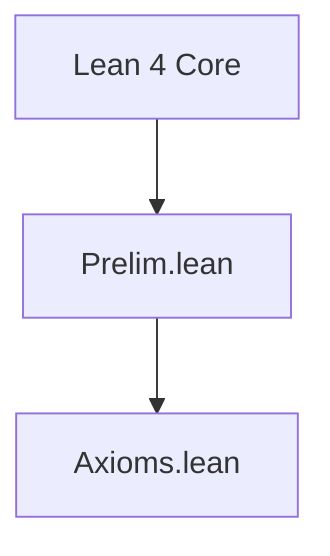

# Technical Reference — Robinson

**Last updated:** 2026-04-26 00:00
**Author**: Julián Calderón Almendros
**Lean version**: v4.29.0

---

## 0. Naming Conventions Guide for the Reader

This project adopts [Mathlib](https://leanprover-community.github.io/contribute/naming.html)-style naming conventions.
Below are the keys for reading and searching theorems.

### 0.1 Capitalization Rules

- **Theorems/lemmas** (Prop): `snake_case` — `union_comm`, `mem_powerset_iff`
- **Prop definitions** (predicates): `UpperCamelCase` — `IsNat`, `IsFunction`; in theorem names → `lowerCamelCase`: `isNat_zero`
- **Functions** (returning values): `lowerCamelCase` — `powerset`, `union`, `sUnion`
- **Acronyms**: as group — `ZFC` (namespace), `zfc` (in snake_case)

### 0.2 Symbol-to-Word Dictionary

| Symbol | Name | | Symbol | Name | | Symbol | Name |
|--------|------|---|--------|------|---|--------|------|
| ∈ | `mem` | | ∪ | `union` | | + | `add` |
| ∉ | `not_mem` | | ∩ | `inter` | | * | `mul` |
| ⊆ | `subset` | | ⋃ | `sUnion` | | - | `sub`/`neg` |
| ⊂ | `ssubset` | | ⋂ | `sInter` | | / | `div` |
| 𝒫 | `powerset` | | \ | `sdiff` | | ^ | `pow` |
| σ | `succ` | | △ | `symmDiff` | | ∣ | `dvd` |
| ∅ | `empty` | | ᶜ | `compl` | | ≤ | `le` |
| = | `eq` | | ⟂ | `disjoint` | | < | `lt` |
| ≠ | `ne` | | ↔ | `iff` | | 0 | `zero` |
| ¬ | `not` | | → | `of` | | 1 | `one` |

### 0.3 Theorem Name Structure

- **Conclusion first**: `isNat_succ_of_isNat` — conclusion (`isNat_succ`) before hypotheses (`of_isNat`) with `_of_`
- **Biconditionals**: suffix `_iff` — `mem_powerset_iff` (∈ 𝒫 ↔ ⊆)
- **Directions of an iff**: `.mp` (→) and `.mpr` (←) — `mem_powerset_iff.mp`
- **Specifications**: `mem_X_iff` — `mem_succ_iff`, `mem_inter_iff`, `mem_union_iff`

### 0.4 Axiomatic Suffixes

| Suffix | Meaning | | Suffix | Meaning |
|--------|---------|---|--------|---------|
| `_comm` | commutativity | | `_self` | op with itself |
| `_assoc` | associativity | | `_left`/`_right` | lateral variant |
| `_refl` | reflexivity | | `_cancel` | cancellation |
| `_trans` | transitivity | | `_mono` | monotonicity |
| `_antisymm` | antisymmetry | | `_inj` | injectivity (iff) |
| `_symm` | symmetry | | `_injective` | injectivity (pred) |

### 0.5 Naming Migration Status

*(Update this section as the project evolves. Example:)*

✅ **Phase N completed** (date): Names migrated to Mathlib conventions. Examples: ...

---

## 📋 Compliance with AI-GUIDE.md

This document complies with all requirements specified in [AI-GUIDE.md](AI-GUIDE.md):

✅ **(1)** All `.lean` modules documented in section 1.1
✅ **(2)** Dependencies between modules (table with dependencies column)
✅ **(3)** Namespaces and relationships (table with namespace column)
✅ **(4)** Definitions with location, namespace, and declaration order
✅ **(5)** Axioms and definitions with:

- Human-readable mathematical notation
- Lean 4 signature for code usage
- Explicit dependencies
✅ **(6)** Main theorems without proof with:
- Human-readable mathematical notation
- Lean 4 signature for code usage
- Explicit dependencies
✅ **(7)** Only proven/constructed content (no pending items)
✅ **(8)** Continuous update when loading `.lean` files
✅ **(9)** Self-sufficient as sole reference (no need to load entire project)

---

## 1. Module Overview

### 1.1 Module Table

| Module | Namespace | Dependencies | Status |
|--------|-----------|--------------|--------|
| `Prelim.lean` | top-level | none (Lean 4 core only) | ✅ Completo |
| `Axioms.lean` | `Robinson` | `Prelim.lean` | ✅ Completo |

*Status codes*: ✅ Complete · 🧊 Frozen · 🔶 Partial · 🔄 In progress · ❌ Pending

---

## 2. Dependency Graph



**Note**: This project has no external dependencies. It uses only Lean 4's core library.
The project is strictly constructive (no classical axioms).

*(Update this diagram as modules are added)*

---

## 3. Module Descriptions

### 3.1 Axioms.lean

**Namespace**: `Robinson`
**Dependencies**: `Prelim.lean`
**Last updated**: 2026-04-26 00:00
**Status**: ✅ Completo
**@axiom_system**: `Robinson Arithmetic (Q)`
**@importance**: `foundational`

Implementación constructiva de la Aritmética de Robinson (Q) como tipo inductivo.
En lugar de axiomas, define ℕ como tipo inductivo con constructores `zero` y `succ`,
y las operaciones `add` y `mul` por recursión estructural. Los "axiomas" Q1-Q7 de
Robinson se convierten en teoremas probados.

**Nota constructivista**: Esta implementación es MÁS FUERTE que la Aritmética de
Robinson axiomática porque tenemos el principio de inducción disponible del tipo
inductivo. Sin embargo, es completamente constructiva y suficiente para demostrar
los teoremas de incompletitud de Gödel.

#### Tipo Inductivo ℕ

**Definición matemática**: ℕ ::= zero | succ(ℕ)

**Lean 4 signature**:

```lean
inductive ℕ : Type where
  | zero : ℕ
  | succ : ℕ → ℕ
```

**Computabilidad**: completamente computable (tipo inductivo)
**Dependencies**: ninguna (Lean 4 core)

#### Operaciones Primitivas

**Zero (constante)**:

```lean
def zero : ℕ := ℕ.zero
```

**Sucesor (función)**:

```lean
def succ : ℕ → ℕ := ℕ.succ
```

**Suma (definición recursiva)**:

Definición matemática:
- x + 0 = x
- x + S(y) = S(x + y)

```lean
def add : ℕ → ℕ → ℕ
  | x, ℕ.zero => x
  | x, ℕ.succ y => ℕ.succ (add x y)
```

**Multiplicación (definición recursiva)**:

Definición matemática:
- x · 0 = 0
- x · S(y) = (x · y) + x

```lean
def mul : ℕ → ℕ → ℕ
  | x, ℕ.zero => ℕ.zero
  | x, ℕ.succ y => add (mul x y) x
```

#### Notación

| Símbolo | Expande a | Prioridad |
|---------|-----------|-----------|
| `𝟘` | `zero` | max (prefix) |
| `𝐒` | `succ` | max (prefix) |
| `+` | `add` | 65 (infixl) |
| `*` | `mul` | 70 (infixl) |

**Nota**: Se usan símbolos Unicode 𝟘 (U+1D7D8) y 𝐒 (U+1D412) para evitar conflictos
con los naturales incorporados de Lean.

#### Axiomas de Robinson (ahora teoremas)

**Q1 - Zero no es sucesor**: ∀x. S(x) ≠ 0

```lean
theorem Q_zero_not_succ : ∀ (x : ℕ), succ x ≠ zero
```

**Q2 - Sucesor es inyectivo**: ∀x ∀y. S(x) = S(y) → x = y

```lean
theorem Q_succ_injective : ∀ (x y : ℕ), succ x = succ y → x = y
```

**Q3 - Función de decisión para zero**:

```lean
def isZero : ℕ → Bool
  | ℕ.zero => true
  | ℕ.succ _ => false

theorem isZero_spec_true : ∀ (x : ℕ), isZero x = true → x = zero

theorem isZero_spec_false : ∀ (x : ℕ), isZero x = false → x ≠ zero
```

**Q3 - Predecesor**: ∀x. x ≠ 0 → ∃y. x = S(y)

```lean
theorem Q_pred : ∀ (x : ℕ), x ≠ zero → ∃ y, x = succ y
```

**Q4 - Suma con zero**: ∀x. x + 0 = x

```lean
theorem Q_add_zero : ∀ (x : ℕ), add x zero = x
```

**Q5 - Suma con sucesor**: ∀x ∀y. x + S(y) = S(x + y)

```lean
theorem Q_add_succ : ∀ (x y : ℕ), add x (succ y) = succ (add x y)
```

**Q6 - Multiplicación con zero**: ∀x. x · 0 = 0

```lean
theorem Q_mul_zero : ∀ (x : ℕ), mul x zero = zero
```

**Q7 - Multiplicación con sucesor**: ∀x ∀y. x · S(y) = (x · y) + x

```lean
theorem Q_mul_succ : ∀ (x y : ℕ), mul x (succ y) = add (mul x y) x
```

#### Propiedades Derivadas

**Unicidad de zero**:

```lean
theorem zero_unique (x : ℕ) (h : ∀ y, succ y ≠ x) : x = zero
```

**Sucesor no es igual a sí mismo**:

```lean
theorem succ_ne_self : ∀ (x : ℕ), succ x ≠ x
```

**Función predecesor (computable)**:

```lean
def pred (x : ℕ) (h : x ≠ zero) : ℕ

theorem pred_spec (x : ℕ) (h : x ≠ zero) : x = succ (pred x h)
```

#### Instancia Decidable

```lean
instance (x : ℕ) : Decidable (x = zero)
```

Permite usar `if x = zero then ... else ...` de manera constructiva.

**Computabilidad**: completamente computable (pattern matching sobre tipo inductivo)

### 3.2 Prelim.lean

**Namespace**: top-level (no namespace wrapper)
**Dependencies**: none (Lean 4 core only, **no classical axioms**)
**Last updated**: 2026-04-26 00:00
**Status**: ✅ Completo
**@axiom_system**: `none` (strictly constructive)
**@importance**: `foundational`

Foundational infrastructure used by all modules: custom `ExistsUnique` with full API,
both `∃!` and `∃¹` notations, dot-notation style and Peano-compatible aliases.

**Note**: This project is completely independent of Mathlib. All development is from scratch.

**⚠️ CONSTRUCTIVE**: No `Classical.choose`, no LEM, no AC. All witnesses are explicit.
All operations are computable. This module sets the constructivist foundation for the entire project.

#### ExistsUnique

**Mathematical statement**: p has a unique witness iff ∃ x, p x ∧ ∀ y, p y → y = x

**Lean 4 signature**:

```lean
def ExistsUnique {α : Sort u} (p : α → Prop) : Prop :=
  ∃ x, p x ∧ ∀ y, p y → y = x
```

**Computability**: **fully computable** (witness extracted directly from proof structure)
**Dependencies**: Lean 4 core only (no classical axioms)

**Full API**:

| Name (dot-notation) | Peano alias | Description |
|---------------------|-------------|-------------|
| `ExistsUnique.intro w hw h` | — | constructor |
| `ExistsUnique.exists h` | — | extracts `∃ x, p x` |
| `ExistsUnique.unique h` | `unique_of_existsUnique h` | uniqueness: any two witnesses are equal |

**Nota constructivista**: No hay función `choose` porque requeriría `Classical.choose`.
Para extraer el testigo, usa pattern matching: `obtain ⟨w, hw, huniq⟩ := h`.

**Lean 4 signatures**:

```lean
theorem ExistsUnique.intro {α : Sort u} {p : α → Prop} (w : α)
    (hw : p w) (h : ∀ y, p y → y = w) : ExistsUnique p

theorem ExistsUnique.exists {α : Sort u} {p : α → Prop}
    (h : ExistsUnique p) : ∃ x, p x

theorem ExistsUnique.unique {α : Sort u} {p : α → Prop}
    (h : ExistsUnique p) : ∀ x y, p x → p y → x = y

-- Peano-compatible alias:
theorem unique_of_existsUnique {α : Sort u} {p : α → Prop}
    (h : ExistsUnique p) : ∀ x y, p x → p y → x = y
```

**Uso constructivo**: Para extraer el testigo, usa pattern matching:

```lean
obtain ⟨w, hw, huniq⟩ := h
-- w : α es el testigo
-- hw : p w es la prueba de que w satisface p
-- huniq : ∀ y, p y → y = w es la prueba de unicidad
```

---

## 4. Theorems

### 4.1 Axioms.lean

Todos los teoremas están listados en §3.1 bajo "Axiomas de Robinson" y "Propiedades Derivadas".

Resumen:
- **Q1-Q7**: Los 7 axiomas de Robinson, ahora probados como teoremas
- **isZero_spec_true/false**: Especificaciones de la función de decisión
- **zero_unique**: Unicidad del cero
- **succ_ne_self**: El sucesor nunca es igual a sí mismo
- **pred_spec**: Especificación de la función predecesor

Todos los teoremas son **constructivos** y **computables**.

### 4.2 Prelim.lean

*(See ExistsUnique API table in §3.2 — all theorems listed there)*

---

## 5. Notations

| Symbol | Expands to | Module | Variants | Priority |
|--------|-----------|--------|---------|----------|
| `∃! x, p` | `ExistsUnique (fun x => p)` | `Prelim.lean` | untyped only | — |
| `∃¹ x, p` | `ExistsUnique (fun x => p)` | `Prelim.lean` | `∃¹ x`, `∃¹ (x)`, `∃¹ (x : T)`, `∃¹ x : T` | — |
| `𝟘` | `zero` | `Axioms.lean` | prefix | max |
| `𝐒` | `succ` | `Axioms.lean` | prefix | max |
| `+` | `add` | `Axioms.lean` | infixl | 65 |
| `*` | `mul` | `Axioms.lean` | infixl | 70 |

**Notes**:
- `∃!` overrides Lean's built-in notation. Use `∃¹` to avoid any macro conflicts.
- `𝟘` (U+1D7D8) and `𝐒` (U+1D412) are Unicode symbols to avoid conflicts with Lean's built-in naturals.

---

## 6. Exports

### 6.1 Axioms.lean

Todas las declaraciones públicas del namespace `Robinson`:

```lean
-- Tipo y constructores
ℕ zero succ add mul

-- Teoremas Q1-Q7
Q_zero_not_succ Q_succ_injective 
isZero isZero_spec_true isZero_spec_false Q_pred
Q_add_zero Q_add_succ Q_mul_zero Q_mul_succ

-- Propiedades derivadas
zero_unique succ_ne_self pred pred_spec
```

**Computabilidad**: Todas las funciones (`zero`, `succ`, `add`, `mul`, `isZero`, `pred`)
son completamente computables. Todos los teoremas son constructivos.

### 6.2 Prelim.lean

All names are top-level (no namespace), accessible wherever `Prelim.lean` is imported:

```lean
-- Definitions
ExistsUnique                -- Prop-valued predicate

-- Notation
∃! x, p                    -- unique existence (overrides built-in)
∃¹ x, p                    -- unique existence (safe, 4 variants)

-- Dot-notation API
ExistsUnique.intro
ExistsUnique.exists
ExistsUnique.unique

-- Peano-compatible alias
unique_of_existsUnique
```

**All operations are computable.** No classical axioms used.

**No `choose` function**: Extracting the witness requires pattern matching (`obtain`),
which is the constructive way to work with existential proofs.

---

## 7. Documentation Status

### 7.1 Fully Projected Files

- `Prelim.lean` — ExistsUnique complete (1 def + 3 theorems + 1 alias + 2 notations)
- `Axioms.lean` — Robinson Arithmetic complete (1 inductive type + 4 defs + 4 notations + 11 theorems + 1 instance)

### 7.2 Partially Projected Files

*(None)*

### 7.3 Notes

**Constructivismo**: El módulo `Axioms.lean` implementa la Aritmética de Robinson de
manera completamente constructiva usando un tipo inductivo en lugar de axiomas. Esto
hace que el sistema sea más fuerte (tenemos inducción) pero mantiene el constructivismo
estricto del proyecto.

**Próximos pasos**: Con la aritmética básica establecida, el siguiente paso será
desarrollar la teoría necesaria para la codificación de Gödel (numerales, funciones
recursivas primitivas, etc.).
