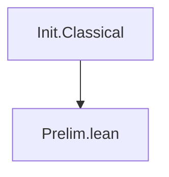

# Technical Reference — Robinson

**Last updated:** 2026-04-10 00:00
**Author**: Julián Calderón Almendros
**Lean version**: v4.28.0

---

## 0. Naming Conventions Guide for the Reader

This project adopts [Mathlib](https://leanprover-community.github.io/contribute/naming.html)-style naming conventions.
Below are the keys for reading and searching theorems.

### 0.1 Capitalization Rules

- **Theorems/lemmas** (Prop): `snake_case` — `union_comm`, `mem_powerset_iff`
- **Prop definitions** (predicates): `UpperCamelCase` — `IsNat`, `IsFunction`; in theorem names → `lowerCamelCase`: `isNat_zero`
- **Functions** (returning values): `lowerCamelCase` — `powerset`, `union`, `sUnion`
- **Acronyms**: as group — `ZFC` (namespace), `zfc` (in snake_case)

### 0.2 Symbol-to-Word Dictionary

| Symbol | Name | | Symbol | Name | | Symbol | Name |
|--------|------|---|--------|------|---|--------|------|
| ∈ | `mem` | | ∪ | `union` | | + | `add` |
| ∉ | `not_mem` | | ∩ | `inter` | | * | `mul` |
| ⊆ | `subset` | | ⋃ | `sUnion` | | - | `sub`/`neg` |
| ⊂ | `ssubset` | | ⋂ | `sInter` | | / | `div` |
| 𝒫 | `powerset` | | \ | `sdiff` | | ^ | `pow` |
| σ | `succ` | | △ | `symmDiff` | | ∣ | `dvd` |
| ∅ | `empty` | | ᶜ | `compl` | | ≤ | `le` |
| = | `eq` | | ⟂ | `disjoint` | | < | `lt` |
| ≠ | `ne` | | ↔ | `iff` | | 0 | `zero` |
| ¬ | `not` | | → | `of` | | 1 | `one` |

### 0.3 Theorem Name Structure

- **Conclusion first**: `isNat_succ_of_isNat` — conclusion (`isNat_succ`) before hypotheses (`of_isNat`) with `_of_`
- **Biconditionals**: suffix `_iff` — `mem_powerset_iff` (∈ 𝒫 ↔ ⊆)
- **Directions of an iff**: `.mp` (→) and `.mpr` (←) — `mem_powerset_iff.mp`
- **Specifications**: `mem_X_iff` — `mem_succ_iff`, `mem_inter_iff`, `mem_union_iff`

### 0.4 Axiomatic Suffixes

| Suffix | Meaning | | Suffix | Meaning |
|--------|---------|---|--------|---------|
| `_comm` | commutativity | | `_self` | op with itself |
| `_assoc` | associativity | | `_left`/`_right` | lateral variant |
| `_refl` | reflexivity | | `_cancel` | cancellation |
| `_trans` | transitivity | | `_mono` | monotonicity |
| `_antisymm` | antisymmetry | | `_inj` | injectivity (iff) |
| `_symm` | symmetry | | `_injective` | injectivity (pred) |

### 0.5 Naming Migration Status

*(Update this section as the project evolves. Example:)*

✅ **Phase N completed** (date): Names migrated to Mathlib conventions. Examples: ...

---

## 📋 Compliance with AI-GUIDE.md

This document complies with all requirements specified in [AI-GUIDE.md](AI-GUIDE.md):

✅ **(1)** All `.lean` modules documented in section 1.1
✅ **(2)** Dependencies between modules (table with dependencies column)
✅ **(3)** Namespaces and relationships (table with namespace column)
✅ **(4)** Definitions with location, namespace, and declaration order
✅ **(5)** Axioms and definitions with:

- Human-readable mathematical notation
- Lean 4 signature for code usage
- Explicit dependencies
✅ **(6)** Main theorems without proof with:
- Human-readable mathematical notation
- Lean 4 signature for code usage
- Explicit dependencies
✅ **(7)** Only proven/constructed content (no pending items)
✅ **(8)** Continuous update when loading `.lean` files
✅ **(9)** Self-sufficient as sole reference (no need to load entire project)

---

## 1. Module Overview

### 1.1 Module Table

| Module | Namespace | Dependencies | Status |
|--------|-----------|--------------|--------|
| `Prelim.lean` | top-level | `Init.Classical` | ✅ Completo |

*Status codes*: ✅ Complete · 🧊 Frozen · 🔶 Partial · 🔄 In progress · ❌ Pending

---

## 2. Dependency Graph



*(Update this diagram as modules are added)*

---

## 3. Module Descriptions

### 3.1 Prelim.lean

**Namespace**: top-level (no namespace wrapper)
**Dependencies**: `Init.Classical`
**Last updated**: 2026-04-10 00:00
**Status**: ✅ Completo
**@axiom_system**: `none`
**@importance**: `foundational`

Foundational infrastructure used by all modules: custom `ExistsUnique` with full API,
both `∃!` and `∃¹` notations, dot-notation style and Peano-compatible aliases.

#### ExistsUnique

**Mathematical statement**: p has a unique witness iff ∃ x, p x ∧ ∀ y, p y → y = x

**Lean 4 signature**:

```lean
def ExistsUnique {α : Sort u} (p : α → Prop) : Prop :=
  ∃ x, p x ∧ ∀ y, p y → y = x
```

**Computability**: noncomputable (witness extraction uses `Classical.choose`)
**Dependencies**: `Init.Classical`

**Full API**:

| Name (dot-notation) | Peano alias | Description |
|---------------------|-------------|-------------|
| `ExistsUnique.intro w hw h` | — | constructor |
| `ExistsUnique.exists h` | `ExistsUnique.exists h` | extracts `∃ x, p x` |
| `ExistsUnique.choose h` | `choose_unique h` | noncomputable witness |
| `ExistsUnique.choose_spec h` | `choose_spec_unique h` | witness satisfies p |
| `ExistsUnique.unique h y hy` | `choose_uniq h hy` | uniqueness: `y = witness` |

**Lean 4 signatures**:

```lean
theorem ExistsUnique.intro {α : Sort u} {p : α → Prop} (w : α)
    (hw : p w) (h : ∀ y, p y → y = w) : ExistsUnique p

theorem ExistsUnique.exists {α : Sort u} {p : α → Prop}
    (h : ExistsUnique p) : ∃ x, p x

noncomputable def ExistsUnique.choose {α : Sort u} {p : α → Prop}
    (h : ExistsUnique p) : α

theorem ExistsUnique.choose_spec {α : Sort u} {p : α → Prop}
    (h : ExistsUnique p) : p (h.choose)

theorem ExistsUnique.unique {α : Sort u} {p : α → Prop}
    (h : ExistsUnique p) : ∀ y, p y → y = h.choose

-- Peano-compatible aliases:
noncomputable def choose_unique {α : Sort u} {p : α → Prop}
    (h : ExistsUnique p) : α

theorem choose_spec_unique {α : Sort u} {p : α → Prop}
    (h : ExistsUnique p) : p (choose_unique h)

theorem choose_uniq {α : Sort u} {p : α → Prop}
    (h : ExistsUnique p) {y : α} (hy : p y) : y = choose_unique h
```

---

## 4. Theorems

### 4.1 Prelim.lean

*(See ExistsUnique API table in §3.1 — all theorems listed there)*

---

## 5. Notations

| Symbol | Expands to | Module | Variants |
|--------|-----------|--------|---------|
| `∃! x, p` | `ExistsUnique (fun x => p)` | `Prelim.lean` | untyped only |
| `∃¹ x, p` | `ExistsUnique (fun x => p)` | `Prelim.lean` | `∃¹ x`, `∃¹ (x)`, `∃¹ (x : T)`, `∃¹ x : T` |

**Note**: `∃!` overrides Lean's built-in notation. Use `∃¹` to avoid any macro conflicts.

---

## 6. Exports

### 6.1 Prelim.lean

All names are top-level (no namespace), accessible wherever `Prelim.lean` is imported:

```lean
-- Definitions
ExistsUnique                -- Prop-valued predicate

-- Notation
∃! x, p                    -- unique existence (overrides built-in)
∃¹ x, p                    -- unique existence (safe, 4 variants)

-- Dot-notation API
ExistsUnique.intro
ExistsUnique.exists
ExistsUnique.choose         -- noncomputable
ExistsUnique.choose_spec
ExistsUnique.unique

-- Peano-compatible aliases
choose_unique               -- noncomputable
choose_spec_unique
choose_uniq
```

---

## 7. Documentation Status

### 7.1 Fully Projected Files

- `Prelim.lean` — ExistsUnique complete (1 def + 5 theorems/defs + 3 aliases + 2 notations)

### 7.2 Partially Projected Files

*(None)*

### 7.3 Notes

*(None)*
